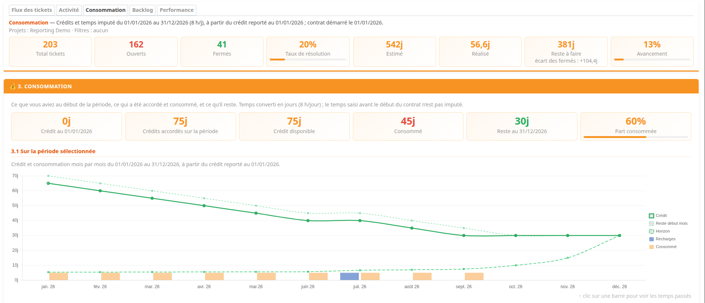

# Redmine Reporting




Project reporting for Redmine: a dashboard of issue flow, activity, time-credit
consumption, backlog and performance, computed from Redmine's own issues and time
entries. Chart selections and linked summary figures open native Redmine lists,
with their filters, columns, sorting and exports.

Version 1.0.0 covers **Run** and **Build & Projects** reports. Run & Support (SLA)
and Workload & Team reports are planned.

## Requirements

- Redmine 5.0 through 7.0, with Ruby 3.1 or later supported by that Redmine release.
  See the [compatibility matrix](test/compatibility/README.md) for the exact tested combinations.
- No external service: Chart.js 4.4.0 (MIT) is bundled with the plugin's assets.
- Optional, from 1.1.0: the redmine_sla plugin for SLA reports.

## Installation

Source code and issue tracker: [likehopper/redmine_reporting](https://github.com/likehopper/redmine_reporting).

```sh
# Extract the plugin into /path/to/redmine/plugins/redmine_reporting first.
cd /path/to/redmine
RAILS_ENV=production bundle exec rake redmine:plugins:migrate NAME=redmine_reporting
```

Restart Redmine, then for each project:

1. Enable the **Reporting** module (project settings, *Modules*).
2. Give roles the permissions they need:
   - *View reporting* (`view_reporting`) to open the dashboard;
   - *Configure reporting* (`manage_reporting`) for the **Reporting** settings tab and
     time credits.

### Upgrading

1. Back up the Redmine database and the currently installed plugin directory.
2. Read the [changelog](CHANGELOG.md) and check the exact supported combination in
   the [compatibility matrix](test/compatibility/README.md).
3. Stop the Redmine application processes, replace `plugins/redmine_reporting`
   with the new release, then run from the Redmine root:

   ```sh
   RAILS_ENV=production bundle exec rake redmine:plugins:migrate NAME=redmine_reporting
   ```

4. Restart Redmine and check the dashboard and project settings with the intended
   user roles. When upgrading a deployed application, use its normal plugin asset
   deployment procedure as well.

To return to the previous release after a schema change, restore the matching
plugin directory and database backup together. The automated matrix checks a
fresh install and uninstall/reinstall; it does not replace validation of an upgrade
against your existing data.

### Uninstalling

Uninstalling deletes the plugin's stored settings, credit policies and refills.
Back up the database first, stop Redmine, and run from the Redmine root while the
plugin directory is still present:

```sh
RAILS_ENV=production bundle exec rake redmine:plugins:migrate NAME=redmine_reporting VERSION=0
```

Remove `plugins/redmine_reporting`, then restart Redmine.

## The dashboard

Enable **Build & Projects** in project settings and classify its trackers as **Build**.
The family selector opens three charts: open/closed issues by version (closure
percentage in the tooltip), overdue open issues by version (version deadline in
the tooltip), and estimated/spent/calculated remaining/overrun hours. Issues without
a version have their own group. These charts show the current state across all
dates, rather than reconstructing historical version membership. Remaining hours
sum positive estimated-minus-spent gaps on open issues; overruns sum positive
spent-minus-estimated gaps. An absent estimate counts as zero. Only visible logged
time contributes; the effort chart requires time-viewing permissions. Clicks open
native issue lists scoped to the chosen version and status, with time columns for
effort charts. The effort list shows all contributing issues (open ones for remaining),
not just overrunning issues. BUILD with no classified tracker stays empty; time
without an issue is excluded.


The *Reporting* project menu opens five tabs, over a date range and a grouping (day,
week, month or quarter), with Redmine's native filters (subprojects, tracker, status,
priority, target version):

| Tab | Charts |
|---|---|
| Issue flow | creations and closures per tracker and priority, per period, cumulated; open and closed issues by status |
| Activity | time logged per collaborator and per activity |
| Consumption | credit on the first day, credits granted, consumption and credit left over the selected period, and over the contract; summary per subproject |
| Backlog | issues not closed at each period end, per tracker and priority; time left to do |
| Performance | velocity, average resolution time per priority, age of open issues |

A sticky banner states what the active tab counts (dates, grouping, projects,
filters) and gives the provider's view of the period: issues (total, open, closed,
resolution rate) and work on those same issues (estimated, done, left to do,
progress). The consumption tab gives the client's view: the credit on the first
day, the credits granted, what was consumed and what is left. A click on a bar, a
point, anywhere in a period's column or on a period label opens the native issue or
time entry list; the banner and consumption figures open theirs too.

Flow and backlog legends stay below their charts. Status, activity and consumption
legends appear on the right when space allows, and below on narrow screens.
Collaborator bars are stacked by activity, sharing chart 2.2's colors; clicking a
segment filters both collaborator and activity. Consumption legend entries show
explanatory tooltips on hover. Every chart has an explanatory subtitle.

Texts follow the user's language (French or English). Dates follow the user's time
zone, as Redmine's date filters do.

### Modules and permissions

Figures follow Redmine's visibility rules for each viewer: issue and time entry
visibility, private issues and projects. On the reporting subtree, issue charts
(flow, backlog, performance) need *View issues*, which Redmine only grants where
*Issue tracking* is enabled; time charts (activity, consumption) need *View spent
time* and *Time tracking*; the time left chart and banner cards need both. A tab
without its data is not shown, and its payload is omitted from the page JSON.
Credits additionally require reporting and time visibility on each contributing project.

## How figures are computed

- **Created / closed** use `created_on` and Redmine's `closed_on`, the last closing
  date. Redmine keeps `closed_on` when an issue is reopened: such an issue still counts
  as a closure of its period in the flow charts, but as open wherever the current
  status matters (status charts, resolution time, velocity, banner).
- **Issues of the period** (banner): created before the end of the period and not
  closed before its start, with currently reopened issues included.
- **Backlog at a date**: created by that date and open according to the status
  transitions in its journals. Without usable history, the current status and last
  closure date are the fallback; deleted history cannot be reconstructed.
- **Estimated, done, left to do, progress** (banner): over the issues of the period
  as filtered, open and closed, as the totals of their native list. *Done* is the time
  spent on them whenever it was logged. *Left to do* only covers the issues still open
  (estimated minus done, negative on overruns); the card also shows the *closed gap*,
  estimated minus done on the closed issues, positive when they took less than planned.
  So estimated − done = left to do + closed gap. *Progress* is done ÷ (done + left to
  do): 100% on closed issues. Issues without an estimate count as zero; their number is
  shown on the *Estimated* card. Without issue tracking, the banner only shows the time
  logged over the period. In the backlog tab, left to do is computed at each period
  end, from the time logged by that date.
- **Resolution time and velocity**: issues closed over the period and still closed.
- **Days**: activity and estimated time use the reporting project's hours per day
  (8 by default). Consumption converts each project's hours using its own inherited
  settings before aggregating credit days.
- **Limits**: dates must be between 1900 and 2200, with at most 600 periods per
  report or credit ledger. Invalid ranges return a visible validation error.

## Time credits

A credit policy belongs to a project and a tracker. Its initial credit is granted
every year on its anniversary date, within its optional validity dates; refills add
credit every year on their own date and validity. February 29 falls on February 28
in non-leap years, and day 31 on the last day of shorter months.

The consumption tab follows the selected period. Credit starts on the earliest
policy start (`active_from`); time logged before it is not charged. The period opens
with the credit carried over to its first day, adds the grants and refills falling in
it, and subtracts the time charged over it: for a 10-day yearly contract with 3 days
used in the first half, a July–December report starts with 7 days. An overrun carries
over and is paid back by later grants, while the displayed credit never goes below
zero; the share consumed can exceed 100%. Without a policy start date, time is
charged from the start of the selected period. The contract chart shows the whole
contract up to the end of the period. The horizon spreads the remaining credit over
the months left.

Each subproject is a credit account of its own, with its whole subtree and its own
contract start; the displayed project is one more account for its own credits and
time. A project's figures add its accounts up, so an overrun on one account never
eats another one's credit. Below the global figures, **Summary by project** lists
each account over the same period; a click opens that subproject's own reporting,
which shows the same values. Its own filters and tracker scope can still differ from
the parent report.

## Project settings

The **Reporting** tab of the project settings holds:

- **Displayed reports**: the report families. Run and Build & Projects are available; the others are listed
  as coming soon. The SLA family will need redmine_sla, its module enabled on the
  project and at least one tracker with an SLA.
- **Time unit**: hours per day, to convert logged time and estimates into days.
- **Tracker scope**: each tracker is Run, Build or unclassified. Once a tracker is Run,
  Run reports, credits and their lists only count Run trackers (time logged without an
  issue still counts); until then, every tracker counts. Build trackers feed the
  Build & Projects reports, including their native detail lists.
- **SLA statuses**: read-only, when redmine_sla is configured for the project. An SLA
  status is a status in which an SLA type's delay elapses; open statuses where no type
  of the project elapses are waiting statuses. Nothing SLA-related is entered here: it
  comes from redmine_sla only.
- **Time credits**: policies and their refills.

A subproject without its own settings uses its nearest configured ancestor's; saving
the tab on the subproject creates its own. Project copies keep the settings and
credits; deleting a project removes them.

## Demo data

```sh
RAILS_ENV=development REPORTING_DEMO_DATABASE=disposable \
  bundle exec rake redmine:plugins:redmine_reporting:seed_demo
```

Use only a disposable development/test database with Redmine default data and an
active administrator. Production and databases containing unrelated projects are
refused. The generator changes global dictionaries and workflows; all changes are
transactional and mail delivery is disabled. Generated accounts have random
passwords and are locked when generation finishes; use the existing administrator
to view the reports.

Creates or refreshes a *Reporting Demo* project and two subprojects over the last 12
months: several hundred issues with realistic workflow histories (status, assignee, done
ratio and version changes, reopenings, postponed versions), time entries, five
collaborators, two roles with their workflows, and credits on each project. It can be
run again without duplicating anything: a later run replays the same stories up to
the current date.

## Development

### Architecture

| Object | Responsibility |
|---|---|
| `ReportingQuery < Query` | native filters, visible project subtree, issue and time entry scopes |
| `RedmineReporting::ReportBuilder` | assembles one report per tab over the same data |
| `RedmineReporting::ReportData` | records loaded once per request: issue timelines, time entries, spent time, credit policies |
| `RedmineReporting::Reports::{Summary, Flow, Activity, Consumption, Backlog, Performance}` | one tab each |
| `RedmineReporting::PeriodGrid`, `Period` | report periods: bounds, labels |
| `RedmineReporting::IssueHistory` | historical status transitions and matching native query predicate |
| `RedmineReporting::DashboardPresenter` | localized dashboard scope, units and links using explicit report/query/period dependencies |
| `RedmineReporting::QueryDescription` | localized presentation of selected filters and projects |
| `RedmineReporting::IssueTimeline` | an issue's dates in the viewer's time zone, and the period rules above |
| `RedmineReporting::SpentTime` | hours per issue, in total or up to a date |
| `RedmineReporting::CreditAccount` | one project's or subproject's credits and charged time, from its contract start; opening balance at any date |
| `RedmineReporting::CreditLedger` | monthly credit balance from an opening balance; accounts added up row by row |
| `ReportingCreditPolicy`, `ReportingCreditRefill` | credit rules (grants, refills, validity) |
| `RedmineReporting::Drilldown` | turns a chart selection into native `IssueQuery` / `TimeEntryQuery` parameters, never ID lists |
| `RedmineReporting::Sections`, `Capabilities` | report families and tabs; what modules and permissions allow |
| `ReportingProjectSetting`, `RedmineReporting::ProjectSettings` | per-project settings and the settings tab |
| `RedmineReporting::SlaSource` | read-only access to redmine_sla |

Query extensions add editable native filters for period membership, historical
backlog and creation/closure dates. The page script is `assets/javascripts/reporting.js`; like Chart.js and
the stylesheet, it is served as a fingerprinted, cacheable plugin asset.

The controllers coordinate authorization, parameter handling and responses. Report
calculations live in the objects above. `DashboardPresenter` owns dashboard descriptions and detail links, using explicit
dependencies instead of helper access to controller instance variables.
`ReportingHelper` contains six view formatting methods; `ProjectsHelperPatch` adds the native project settings tab.
The browser script uses small functions for chart rendering and interactions.
Comments and identifiers are written in English; translations and demo content
may contain French. Small Rails callbacks and similar model validations remain
local when extracting them would obscure their meaning.

### Tests

Unit, integration and browser (system) tests use Redmine's test runner, its core
fixtures and the plugin's fixtures (`test/fixtures`, credit policies and refills on
Redmine's eCookbook projects). With a test database and the plugin migrated:

```sh
export GOOGLE_CHROME_OPTS_ARGS=headless,disable-gpu,no-sandbox,disable-dev-shm-usage
RAILS_ENV=test bundle exec rake redmine:plugins:test NAME=redmine_reporting
```

System tests need Chrome or Chromium and its driver; `redmine:plugins:test:system`
runs them alone. They check what request tests cannot see: every chart is drawn
without a script error inside Redmine's content area, clicks open the matching lists,
and labels follow the user's language.

### Cross-version validation

```sh
bash test/compatibility/run.sh
```

This runs migrations, uninstall/reinstall, unit, integration and Chromium tests in
isolated Docker containers with SQLite. It uses a read-only source snapshot and
prints the directory containing logs and source checksums. See the
[compatibility matrix](test/compatibility/README.md) for scope and limitations.

## Troubleshooting and known limits

| Symptom | What to check |
|---|---|
| Reporting menu missing or access denied | Enable the Reporting module and grant `view_reporting` to a project member's role. |
| Settings tab missing | Grant `manage_reporting` on that project. |
| Activity or consumption missing | Check Time tracking and `view_time_entries`; credit data also requires `view_reporting` on each contributing project. |
| Issue tabs missing | Check Issue tracking and `view_issues` within the selected project scope. |
| No data after filtering | Check project/subproject selection, Run tracker classification, dates and native filters. |
| Invalid date range | Use valid dates between 1900 and 2200 and at most 600 periods; credit contract history is bounded too. |
| Graphs missing while the page loads | Check the browser console and that Chart.js and reporting plugin assets load successfully after deployment. |
| Demo generation refused | Use a disposable development/test database with the explicit flag described above. |

Historical backlog depends on retained status journals. Missing or deleted history
uses the documented fallback. Remaining-time history uses the issue's current
estimate and historical time entries; it does not reconstruct earlier estimates.

Reports load visible records into memory. The compatibility document includes a
volume measurement; installations with larger datasets should measure their own
report ranges. Only the stock Redmine theme and the documented plugin/database
combinations have been validated. SLA reports and Workload & Team
are not implemented in this release; Redmine 7.1 is not certified.

For a reproducible issue report, include the plugin commit/version, Redmine, Ruby,
Rails and database versions, enabled modules and relevant role permissions, chosen
filters/date range, expected versus actual values, and any relevant browser/server
error. Remove credentials and confidential project data from shared diagnostics.

## Community

Please read the [contribution guide](CONTRIBUTING.md) and
[code of conduct](CODE_OF_CONDUCT.md) before participating. Report suspected
vulnerabilities privately according to the [security policy](SECURITY.md).
Use the issue templates for bug reports and feature requests.

## License

Redmine Reporting is licensed under the GNU General Public License, version 2
or (at your option) any later version (GPL-2.0-or-later). See [LICENSE](LICENSE)
and the [publication steps](RELEASING.md). Bundled Chart.js 4.4.0 is covered by the
[MIT license](assets/javascripts/Chart.js.LICENSE.md).
